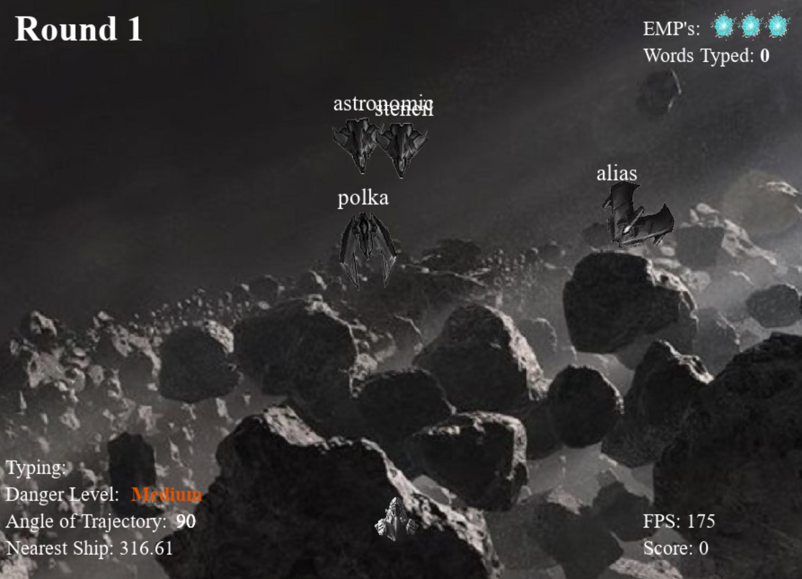
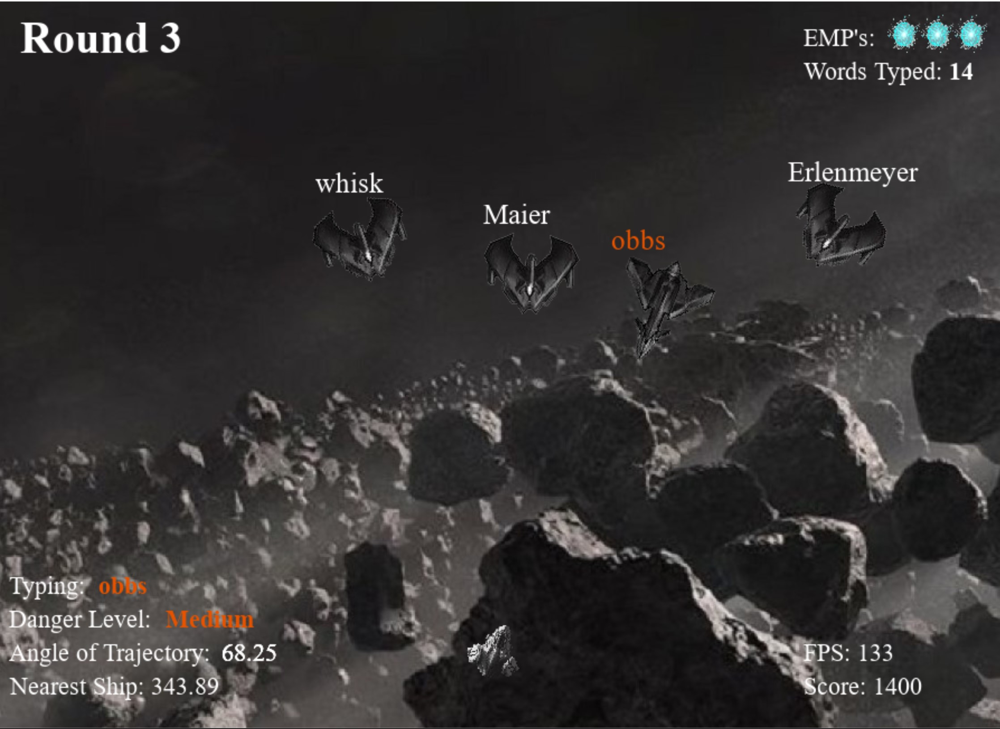
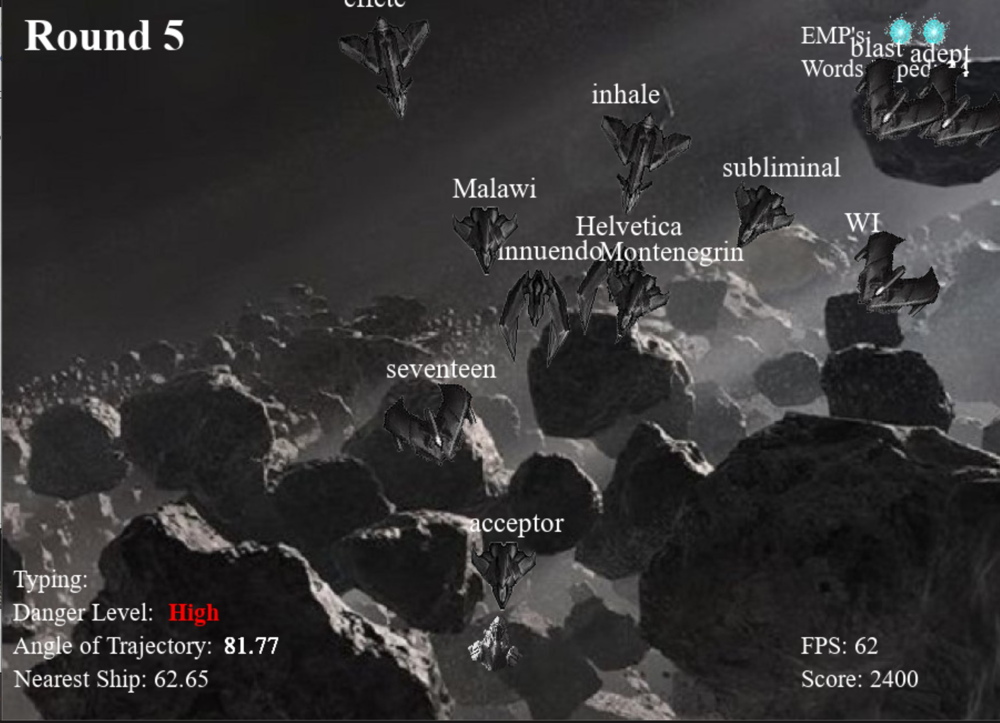
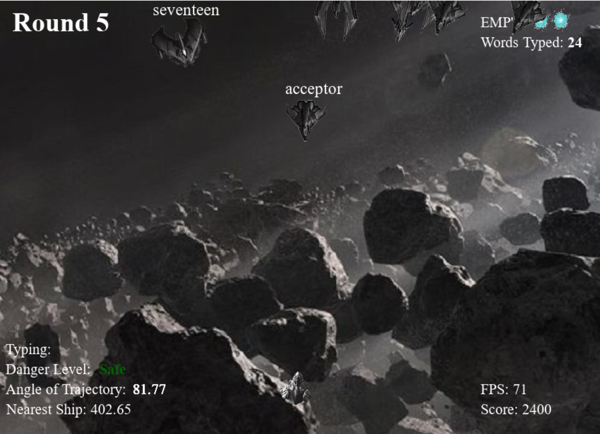

# Typing Master Game

### Technologies:

- Python
- PyGame

## Table of Contents

- [About](#about)
- [Implementation](#implementation)
- [Application Running](#application-running)
- [Author Info](#author-info)

## About

> This game is designed to make the process of learning how to type for students fun and engaging. Words are displayed on the screen and the objective of the game is to typed the words as fast as possible and doing so will result in points awarded. As more words are typed, the levels get harder and more words are needed to be typed to start the next level. The goal is to type as many words possible and get through as many rounds as you can.

## Implementation

Techniques Used:
- File Input/Output
- Error Handling
- Hashmap
- Arrays
- Loops
- Polymorphism
- Graphical User Interface
- Linear Search
- Linked List

PyGame was used to create the graphical user interface.

## Application Running

#### The game starts with round 1 where only four ships of moderate speed are needed to be typed.

---

#### As more words are typed, the rounds increase as well as the enemy ships speed and their quantity.

---

#### This following is some gameplay of Type Master.

---

#### As enemy ships approach closer to the player ship, the danger meter changes the threat level accordingly.

---

#### If the enemy ships get too close, the player has the option to press the "ENTER" button which uses an EMP.

---

#### The player starts off with three EMPS and each one is used as the "ENTER" key is pressed.

---

## Author Info

* LinkedIn - [Ayub Shahab](https://www.linkedin.com/in/ayub-shahab-98b950202/)
